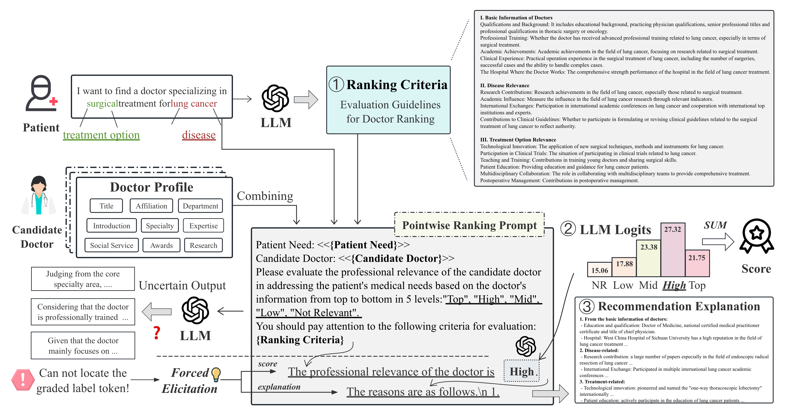

# DrRec-LLM

Code for paper "Towards Explainable Doctor Recommendation with Large Language Models".

- The doctor data utilized in this research was collected from [Haodf Online](https://www.haodf.com), and the ownership of this data belongs to Haodf Online. 
The data source has been clearly acknowledged within the paper. 
We hereby guarantee that the data will be exclusively used for academic purposes.

- Please note that our repository is tailored for Chinese data, but it can be easily adapted for English data by translating the prompts used.

## Overview



An overview of our proposed zero-shot LLM-based doctor ranking framework. 
We leverage a pointwise ranking method to efficiently and effectively evaluate the professional relevance of candidate doctors in addressing specific patient medical needs. 
By utilizing fine-grained relevance labels and incorporating query-specific ranking criteria, our framework ensures consistent and accurate doctor evaluations. 
Furthermore, it provides clear and structured doctor evaluation rationales as recommendation explanations, enhancing the interpretability and transparency of the doctor recommendation process.

## Examples

It should be noted that the ranking criteria and recommendation explanation shown in the overview figure are simplified versions. 

The full versions of them are provided as follows:


```
# The Ranking criteria for lung cancer and surgical treatment

1. Basic Information about the Doctor
    - Education and Qualifications: Whether the doctor holds a Doctor of Medicine (MD) degree, and possesses national certification as a practicing physician with an advanced title (e.g., associate chief physician or chief physician), especially in the fields of thoracic surgery or oncology.
    - Specialized Training: Whether the doctor has received advanced specialized training in lung cancer, such as attending post-graduate programs or seminars at well-known medical institutions, particularly in surgical treatment of lung cancer.
    - Academic Achievements: The doctor’s academic contributions in the field of lung cancer, including high-quality publications, participation in research projects, and academic awards, especially research related to lung cancer surgical treatment.
    - Clinical Experience: The doctor’s practical experience in the surgical treatment of lung cancer, including the number of surgeries performed annually, types of successful cases, and handling of complex cases, such as lobectomy, pneumonectomy, etc.
    - Patient Reviews: Collecting patient feedback on the doctor’s surgical skills, post-operative recovery guidance, communication abilities, and reputation within the patient community.
    - Hospital Affiliation: The overall strength of the hospital in lung cancer treatment, including the presence of a specialized lung cancer diagnosis and treatment center, the advancement of medical equipment, research investment, and collaboration with other medical institutions.

2. Disease Relevance
    - Research Contributions: The doctor’s research achievements in the field of lung cancer, such as published academic papers, participation in research projects, and obtained patents, particularly those directly related to lung cancer surgical treatment.
    - Academic Influence: The doctor’s academic influence in lung cancer research, measured by citation counts, H-index, and other indicators.
    - International Collaboration: Whether the doctor has participated in international lung cancer academic conferences or collaborated with top international medical institutions or experts, especially in lung cancer surgery.
    - Contribution to Clinical Guidelines: Whether the doctor has participated in formulating or revising clinical guidelines or consensus related to the surgical treatment of lung cancer, demonstrating authority in the field.

3. Treatment Methods
    - Technological Innovation: Whether the doctor has introduced or applied new surgical techniques, treatment methods, or medical devices for lung cancer, particularly those aimed at improving surgical safety, reducing complications, and promoting rapid recovery.
    - Clinical Trial Participation: Whether the doctor has participated in clinical trials related to lung cancer, especially those evaluating the effectiveness of new therapies or surgical methods.
    - Teaching and Training: As a mentor or lecturer, the doctor’s contribution to training young physicians or sharing surgical techniques for lung cancer, demonstrating leadership and influence in the professional field.
    - Patient Education: Whether the doctor actively participates in educating lung cancer patients, providing pre- and post-operative guidance to help patients better understand their condition and treatment options.
    - Multidisciplinary Collaboration: Whether the doctor plays an important role in a multidisciplinary team, working closely with other departments (such as respiratory medicine, radiotherapy, pathology, etc.) to provide a comprehensive treatment plan for the patient.
    - Postoperative Management: Whether the doctor has made significant contributions to postoperative management, such as developing personalized rehabilitation plans and monitoring patient recovery.
```

```
# A recommendation explanation for a doctor specializing in surgical treatment for lung cancer

1. From the perspective of the doctor’s qualifications:
    - Education and Qualifications: Professor Bai holds a Ph.D. from Fudan University and is a professor, doctoral supervisor, and postdoctoral advisor with a senior academic title.
    - Professional Training: Professor Bai has received advanced training at institutions such as Peking Union Medical College Hospital and Zhongshan Hospital in Shanghai. He also conducted postdoctoral research under the mentorship of international ARDS expert Michael Matthay at the University of California, San Francisco.
    - Academic Achievements: Professor Bai has published a large number of high-quality papers in the field of lung cancer, earning several national and international academic awards, which have contributed to his high academic influence.
    - Clinical Experience: With 48 years of clinical practice, Professor Bai has extensive experience, particularly in early diagnosis, precision treatment, and smart management of lung cancer.
    - Hospital Affiliation: Zhongshan Hospital affiliated with Fudan University is highly reputable in the field of lung cancer treatment, with a specialized lung cancer diagnosis and treatment center, advanced equipment, and substantial investment in research.

2. Disease-related contributions:
    - Research Contributions: Professor Bai has led the development of multiple expert consensus and guidelines for early diagnosis and precision treatment of lung nodules and lung cancer, making significant academic contributions.
    - Academic Influence: Professor Bai has a high H-index, reflecting his substantial academic impact.
    - International Collaboration: Professor Bai has participated in multiple international academic conferences and collaborated with top international medical institutions and experts.
    - Clinical Guideline Contributions: Professor Bai has contributed to the development of several clinical guidelines or consensus on surgical treatment for lung cancer, highlighting his authoritative position in this field.

3. Treatment-related contributions:
    - Technological Innovation: Professor Bai proposed the concept of “Internet of Medical Things” and applied it to the management of lung nodules and lung cancer, showcasing innovation.
    - Clinical Trial Participation: Professor Bai has participated in multiple clinical trials related to lung cancer, assessing the efficacy of new therapies.
    - Teaching and Training: As a professor and doctoral supervisor, Professor Bai has made significant contributions to training young doctors and sharing surgical techniques for lung cancer.
    - Patient Education: Professor Bai actively engages in patient education, providing guidance before and after surgery.
    - Multidisciplinary Collaboration: Professor Bai plays a vital role in multidisciplinary teams, working closely with other departments to provide comprehensive treatment plans for patients.
    - Postoperative Management: Professor Bai has made notable contributions to postoperative management, formulating personalized rehabilitation plans and monitoring patient recovery.

In summary, Professor Bai is an authoritative expert with extensive experience in the surgical treatment of lung cancer.
```


## Reproducibility

### Ranking Criteria Generation

```bash
python adapter/rank_adapter.py
```

### Ranking Score and Explanation Generation
All experiment scripts can be found in [eval.sh](eval.sh).
```bash
CUDA_VISIBLE_DEVICES="0" python -u eval.py \
  --input_path "data/DrRank_V2.jsonl" \
  --model_name_or_path "Qwen/Qwen2.5-7B-Instruct" \
  --model_type "llm-logit" \
  --max_doctor_length 2048 \
  --batch_size 8 \
  --label_nums 5 \
  --using_criteria \
>> logs/DrRank_V2.Qwen2.5-7B-Instruct.criteria.L5.log
```

### Performance Evaluation w/ evaluation groups

```bash
python eval_group.py
```

## Cite

If you find this repository helpful, feel free to cite our paper:
```latex

```