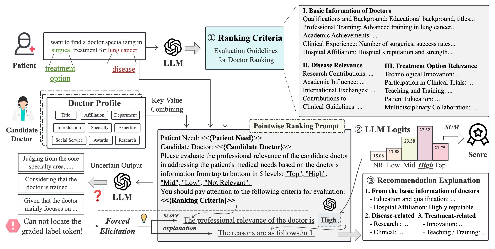

# DrRank

[](https://opensource.org/licenses/MIT)
[](https://www.sciopen.com/article/10.26599/BDMA.2025.9020098)

Code for paper "A Zero-shot Explainable Doctor Ranking Framework with Large Language Models".


## 📢 News

- **[2025.09]** Paper accepted at *Big Data Mining and Analytics* (JCR Q1)!
- **[2025.01]** Code and dataset released.


> **Data Notice**: The doctor data utilized in this research was collected from [Haodf Online](https://www.haodf.com). The ownership belongs to Haodf Online, and the data is used exclusively for academic purposes.

> **Language Support**: This repository is tailored for Chinese data but can be easily adapted for English by translating the prompts.

## Overview



We propose **DrRank**, a zero-shot LLM-based doctor ranking framework designed for explainable doctor recommendation in healthcare systems. Our approach features:

1. **Pointwise Ranking**: Efficiently evaluates the professional relevance of candidate doctors in addressing specific patient medical needs
2. **Fine-grained Relevance Labels**: Uses multi-level relevance labels (Top, High, Mid, Low, Not Relevant) for consistent and accurate doctor evaluations
3. **Query-specific Ranking Criteria**: Automatically generates disease-treatment specific ranking criteria to guide the evaluation
4. **Explainable Recommendations**: Provides clear and structured doctor evaluation rationales as recommendation explanations

## Key Project Files

| File | Description |
|--------|-------------|
| `eval.py` | Main entry point for evaluation. Loads data, initializes models, computes ranking scores and explanations, and evaluates with metrics (NDCG, MAP, Recall, MRR, PNR) |
| `eval_group.py` | Group-based evaluation script that samples subsets for more robust metric computation |
| `adapter/rank_adapter.py` | Generates query-specific ranking criteria using LLMs based on disease-treatment pairs |
| `modeling/model_bert.py` | Implements `CrossEncoder` class for BERT-based cross-encoder reranking |
| `modeling/model_llm_logit.py` | Implements `LlmPointwiseRanker` class for LLM-based pointwise ranking with logit extraction |


## Usage

### Step 1: Ranking Criteria Generation

The ranking criteria adapter generates disease-treatment specific evaluation criteria using LLMs:

```bash
python adapter/rank_adapter.py
```

**What it does:**
1. Extracts unique disease-treatment pairs from the dataset
2. Generates structured ranking criteria for each pair using LLM
3. Saves criteria to `adapter/DrRank_V2_criteria.{model_name}.json`

> 💡 Pre-generated criteria are available in `adapter/DrRank_V2_criteria.Qwen2.5-7B-Instruct.json`

### Step 2: Ranking Score and Explanation Generation

#### Option A: LLM-based Pointwise Ranker (Recommended)

```bash
CUDA_VISIBLE_DEVICES="0" python -u eval.py \
  --input_path "data/DrRank_V2.jsonl" \
  --model_name_or_path "Qwen/Qwen2.5-7B-Instruct" \
  --model_type "llm-logit" \
  --max_doctor_length 2048 \
  --batch_size 8 \
  --label_nums 5 \
  --using_criteria
```

#### Option B: Cross-Encoder (BERT-based, Score only)

```bash
CUDA_VISIBLE_DEVICES="0" python -u eval.py \
  --input_path "data/DrRank_V2.jsonl" \
  --model_name_or_path "BAAI/bge-reranker-v2-m3" \
  --model_type "cross-encoder" \
  --max_doctor_length 2048 \
  --batch_size 96
```

### Evaluation

#### Standard Evaluation

Evaluation runs automatically after scoring. Results are displayed and saved to `runs/`.

| Metric | Description |
|--------|-------------|
| **NDCG@k** | Normalized Discounted Cumulative Gain (primary metric) |
| **MAP@k** | Mean Average Precision |
| **Recall@k** | Recall at k |
| **MRR@k** | Mean Reciprocal Rank |
| **Precision@k** | Precision at k |
| **PNR** | Positive-Negative Ratio |

#### Group-based Evaluation

For robust evaluation with sampling:

```bash
python eval_group.py
```

### Fairness Evaluation

Evaluate model fairness across demographics:

```bash
# Gender-based evaluation
CUDA_VISIBLE_DEVICES="0" python -u eval.py \
  ... \
  --query_prefix "我是男性，我正在寻找"  # Male
  # or
  --query_prefix "我是女性，我正在寻找"  # Female

# Location-based evaluation
CUDA_VISIBLE_DEVICES="0" python -u eval.py \
  ... \
  --query_prefix "我来自城镇，我正在寻找"  # Urban
  # or
  --query_prefix "我来自乡村，我正在寻找"  # Rural
```

## Data Format

### Input (`data/DrRank_V2.jsonl`)

Each line is a JSON object:

```json
{
  "query": "擅长使用手术治疗胃癌的医生专家",
  "pos": ["医生1简介...", "医生2简介..."],
  "pos_scores": [4, 3, 2, 1, 0]
}
```

| Field | Type | Description |
|-------|------|-------------|
| `query` | `str` | Patient medical need (disease + treatment) |
| `pos` | `List[str]` | List of candidate doctor profiles |
| `pos_scores` | `List[int]` | Ground-truth relevance labels (0-4) |

### Output (`runs/*.jsonl`)

Adds prediction fields:

```json
{
  "query": "...",
  "pos": [...],
  "pos_scores": [...],
  "scores": [{"顶级": -1.2, "高级": 0.5, "中级": 0.3, "初级": -0.8, "无关": -2.1}, ...],
  "explanations": ["理由如下：\n1. 从医生资质角度...", ...]
}
```

> **Dataset**: We open-source our crawled candidate doctor pool [here](https://drive.google.com/file/d/14Hrf9ClgE73kOVXQLWmuxBmjUoqsE4u7/view?usp=sharing). Commercial use is prohibited. Please adhere to the [Haodf Online User Policy](https://www.haodf.com).


## Model Architecture

### LLM Pointwise Ranker (`LlmPointwiseRanker`)

The core ranking model uses LLMs in a pointwise manner:

1. **Input Processing**: Formats patient query and doctor profile into a prompt
2. **Score Extraction**: Extracts logits for relevance labels (顶级/高级/中级/初级/无关)
3. **Explanation Generation**: Generates natural language explanation for the ranking decision

**Label Mapping** (5-level):

| Chinese | English | Score |
|---------|---------|-------|
| 顶级 | Top | 4 |
| 高级 | High | 3 |
| 中级 | Mid | 2 |
| 初级 | Low | 1 |
| 无关 | Not Relevant | 0 |

**Configurable Label Levels:**
- **2-level**: 高级 (High), 无关 (NR)
- **3-level**: 高级 (High), 初级 (Low), 无关 (NR)
- **4-level**: 高级 (High), 中级 (Mid), 初级 (Low), 无关 (NR)
- **5-level**: 顶级 (Top), 高级 (High), 中级 (Mid), 初级 (Low), 无关 (NR)

### Cross-Encoder Reranker (`CrossEncoder`)

BERT-based cross-encoder for query-document relevance scoring using HuggingFace's `AutoModelForSequenceClassification`.

## Examples

### Ranking Criteria Example (Lung Cancer + Surgical Treatment)

```markdown
### 1. Basic Information about the Doctor
- Education and Qualifications: Whether the doctor holds a Doctor of Medicine (MD) degree,
  and possesses national certification as a practicing physician with an advanced title
  (e.g., associate chief physician or chief physician), especially in thoracic surgery or oncology.
- Specialized Training: Whether the doctor has received advanced specialized training in
  lung cancer, such as attending post-graduate programs or seminars at well-known medical
  institutions, particularly in surgical treatment of lung cancer.
- Academic Achievements: The doctor's academic contributions in the field of lung cancer,
  including high-quality publications, participation in research projects, and academic awards.
- Clinical Experience: The doctor's practical experience in the surgical treatment of lung
  cancer, including the number of surgeries performed annually, types of successful cases,
  and handling of complex cases (lobectomy, pneumonectomy, etc.).
- Patient Reviews: Collecting patient feedback on the doctor's surgical skills, post-operative
  recovery guidance, communication abilities, and reputation within the patient community.
- Hospital Affiliation: The overall strength of the hospital in lung cancer treatment.

### 2. Disease Relevance
- Research Contributions: The doctor's research achievements in the field of lung cancer.
- Academic Influence: The doctor's academic influence measured by citation counts, H-index.
- International Collaboration: Participation in international lung cancer academic conferences.
- Contribution to Clinical Guidelines: Participation in formulating or revising clinical guidelines.

### 3. Treatment Methods
- Technological Innovation: Whether the doctor has introduced new surgical techniques.
- Clinical Trial Participation: Participation in clinical trials related to lung cancer.
- Teaching and Training: The doctor's contribution to training young physicians.
- Patient Education: Whether the doctor actively participates in patient education.
- Multidisciplinary Collaboration: Role in multidisciplinary teams.
- Postoperative Management: Contributions to postoperative management and recovery.
```

### Recommendation Explanation Example

```markdown
1. From the perspective of the doctor's qualifications:
   - Education and Qualifications: Professor Bai holds a Ph.D. from Fudan University and
     is a professor, doctoral supervisor, and postdoctoral advisor with a senior academic title.
   - Professional Training: Professor Bai has received advanced training at institutions such
     as Peking Union Medical College Hospital and Zhongshan Hospital in Shanghai.
   - Academic Achievements: Professor Bai has published a large number of high-quality papers
     in the field of lung cancer, earning several national and international academic awards.
   - Clinical Experience: With 48 years of clinical practice, Professor Bai has extensive
     experience, particularly in early diagnosis, precision treatment, and smart management.
   - Hospital Affiliation: Zhongshan Hospital affiliated with Fudan University is highly
     reputable in the field of lung cancer treatment.

2. Disease-related contributions:
   - Research Contributions: Professor Bai has led the development of multiple expert
     consensus and guidelines for early diagnosis and precision treatment.
   - Academic Influence: Professor Bai has a high H-index, reflecting substantial academic impact.
   - International Collaboration: Professor Bai has participated in multiple international
     academic conferences and collaborated with top international medical institutions.

3. Treatment-related contributions:
   - Technological Innovation: Professor Bai proposed the concept of "Internet of Medical Things"
     and applied it to the management of lung nodules and lung cancer.
   - Clinical Trial Participation: Professor Bai has participated in multiple clinical trials.
   - Teaching and Training: As a professor and doctoral supervisor, significant contributions
     to training young doctors and sharing surgical techniques for lung cancer.

In summary, Professor Bai is an authoritative expert with extensive experience
in the surgical treatment of lung cancer.
```


## Citation

If you find this work useful, please cite our paper:

```
@misc{zeng2025zeroshotexplainabledoctorranking,
  title={A Zero-shot Explainable Doctor Ranking Framework with Large Language Models}, 
  author={Ziyang Zeng and Dongyuan Li and Yuqing Yang},
  year={2025},
  eprint={2503.02298},
  archivePrefix={arXiv},
  primaryClass={cs.IR},
  url={https://arxiv.org/abs/2503.02298}, 
}
```